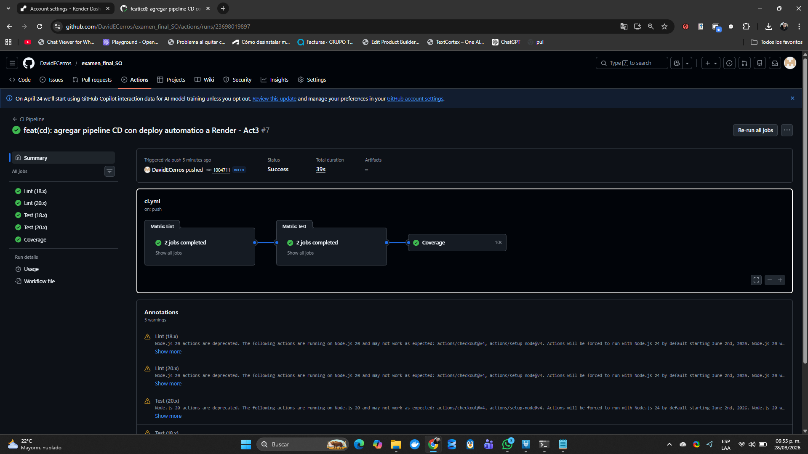

# Examen 2 - CI/CD con GitHub Actions y Docker
**CEUTEC San Pedro Sula | Sistemas Operativos I**

## Estructura del repositorio
- `Dockerfile` - Act1A (corregido)
- `docker-compose.yml` - Act1B
- `.github/workflows/ci.yml` - Act2
- `.github/workflows/cd.yml` - Act3
- `troubleshooting.md` - Act4

---

## Actividad 5: Preguntas Conceptuales

### 1. Diferencia entre CI y CD
**CI (Integracion Continua)** automatiza la integracion del codigo: cada push dispara builds
y tests automaticos para detectar errores rapido.
**CD (Entrega Continua)** va un paso mas alla: si CI pasa, el codigo se despliega
automaticamente a produccion sin intervencion manual.

### 2. GitHub Self-Hosted Runner
Es un servidor propio que ejecuta los jobs de GitHub Actions en lugar de los servidores
de GitHub. Se usa cuando necesitas acceso a red privada, hardware especifico,
software licenciado, o mayor potencia de computo que los runners gratuitos ofrecen.

### 3. GitHub Environments
Son entornos logicos de despliegue (staging, production) que permiten agregar reglas
de proteccion como aprobaciones manuales y secrets especificos por entorno.
En workflows se usan con `environment: production` dentro del job de deploy.

### 4. Rollback Strategy
Es el plan para revertir a una version anterior cuando un deploy falla.
Se implementa guardando el tag/imagen anterior y re-desplegando esa version
si los health checks fallan post-deploy, o via `git revert` + push a main.

---

## Deploy en produccion
URL: https://examen-final-so.onrender.com

## Evidencia de deployment exitoso

